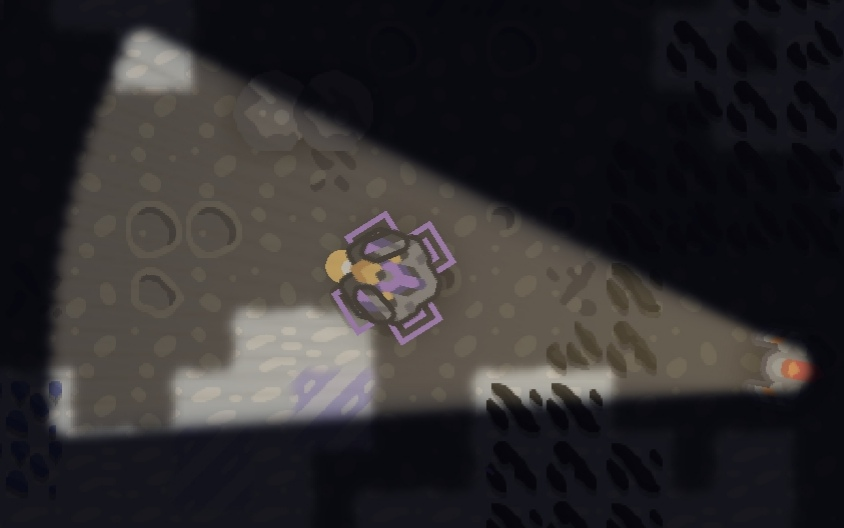

# mindustry-lighting

Adds various types of lighting sources to the player in Mindustry.

# Flashlight
- The default light source of the mod.
- Instead of making light all around, it makes light only in the direction of the player.
- Rays can be obstructed by solid walls, if the player isn't flying or boosting.
- Can show enemies.
- Has settings, although they're limited (Made by @SMOLKEYS).

# Lantern
- Arguably known as the method of lighting the vanilla units used, but it's still similar to this.
- Makes light in every direction.
- Light cannot be obstructed.
- Also shows the enemies.
- Radius' still limited.